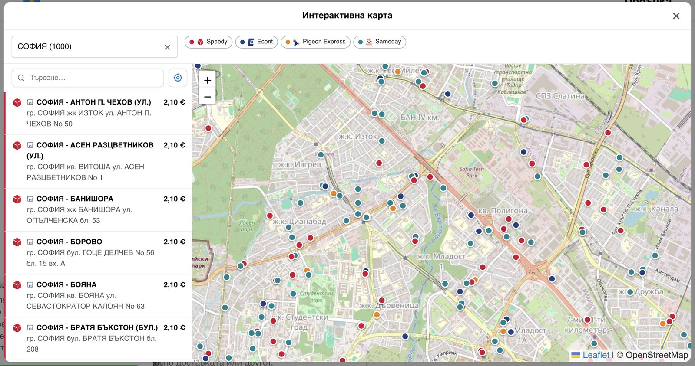

# BG Couriers for WooCommerce

Ship with Bulgaria's couriers straight from WooCommerce - **Speedy, Econt, Pigeon Express, Sameday
and BOX NOW**. Your customer picks where the parcel goes and sees what it costs; you print the label
and follow the parcel without leaving WordPress.

**Install it from WordPress.org:** https://wordpress.org/plugins/bg-couriers/
Free, GPL, and staying that way - every courier, every feature, no paid tier. Deliveries are within
Bulgaria.

### What your customer sees

Every courier you switch on shows its own price for the basket, live from that courier's API. The
customer picks how the parcel is delivered - **to an office, to an address, or to a locker/APS** -
and finds the office by typing the town, or by pointing at it on one map that carries every courier's
offices and lockers at once, each with its own price. The map can also say which pickup point is
closest to them, and what collecting from it saves against delivery to the door.

### What you get in the admin

One click issues the waybill and the label - one order, or fifty of them into a single PDF (A6 labels
or an A4 sheet). Each shipment's status is then kept up to date on its own, and your customer sees
the waybill and a tracking link on their order and in the e-mails you already send them. Cash on
delivery, several parcels per shipment, insurance and free-shipping thresholds are all settings, not
code.

### Setting it up

You need your own account with each courier you want to offer - the prices your customers see and
the labels you print are your own contract's, and nothing is resold through this plugin. Then, per
courier:

1. Paste the API credentials on that courier's tab and switch the courier on. It checks them with the
   courier there and then, and says so plainly if they are refused.
2. Sync its towns and offices - one button.
3. Add it to your **Bulgaria** shipping zone - and to the zone of any other country you deliver to.

Everything else already has a working default. Getting the credentials is the slow part, and
[`docs/getting-api-credentials.md`](docs/getting-api-credentials.md) says who to ask, per courier.

Bugs and ideas: https://github.com/dangoriaynov/bg-couriers/issues
Working on the code: [`CONTRIBUTING.md`](CONTRIBUTING.md) - architecture, tests, releasing.

---

## Courier status

| Courier | Status | Notes |
|---|---|---|
| **Speedy** | ✅ Live on `main` | checkout (office/address/APS), live quotes, labels, tracking, settings |
| **Econt** | ✅ Live on `main` | + **наложен платеж (COD)** with itemised packing list (опис) & ППП money-transfer agreement - live-verified; E2E 7/7 with Speedy |
| **Express One** | 🧪 On `main`, test account | checkout (office/address/EXOBOX locker), live quotes per destination type, labels, tracking, cancel, courier request. Driven through the real checkout on dev - all three delivery kinds ordered, booked, printed, tracked and cancelled - against Express One's **test** environment; production credentials not yet issued. Its street box takes only streets Express One lists, because its waybills refuse anything else |
| **Pigeon Express** | ✅ Live on `main` | checkout (office/address), live quotes, labels; tracking live-verified against real shipments |
| **BOX NOW** | ✅ Live on `main` | locker-only, flat-rate, OAuth2, **map-widget** locker picker; full create → label → track → cancel cycle verified. Needs a prepaid gateway to be offered at checkout: it cannot do наложен платеж |
| **Sameday** | ✅ Live on `main` | checkout (address/APS), live quotes, labels, tracking; create → PDF → track → cancel verified against a live account (easyBox-only on it) |
| **Европът (Evropat-2000)** | ✅ Built on `main` (unreleased) | checkout (office/address), live per-destination quotes, labels, tracking, cancel, courier request. Measured against a live account 2026-08-31; one waybill created and cancelled. **Printing is the one path not yet proven end to end** - the endpoint their docs name (`/print`) does not exist, and `/printshipment` was found after the test waybill had been cancelled. No lockers in BG (`countryBoxDeliveryAvailable: 0`), no public tracking page, one API key and no username |
| **Български пощи** | ❌ Not planned | no public API - integration only under contract, and *no* Bulgarian integrator carries them (Izprati, CloudCart, SELITON, PRIM.IO all omit them). Dropped 2026-08-17 |

## Features in detail

- **Delivery types** per courier - to office / to address / to APS (locker) - as searchable checkout tabs
  (BoxNow is locker-only via its map widget).
- **Live pricing** from each courier's API, with a **daily reference baseline** (shown before a destination
  is picked) and a configured per-method fallback when the API is down. BoxNow is a flat configured rate
  (no rate API). Prices are net; WooCommerce adds 20% VAT once (no double-VAT).
- **Labels & tracking** - per-order + bulk "Generate labels" → one combined PDF (A6 label / A4 office),
  waybill + track link at the top of the order, copy-waybill in the orders list.
- **Econt COD (наложен платеж)** - itemised опис (seq / name / weight / qty / price), the ППП postal-money-
  transfer agreement, sum(price×count) reconciled to the collected amount; live-verified with a real waybill.
- **Cart shipping estimate** - optional per-courier + delivery-type estimate on the cart page.
- **Courier-aware checkout validation** - an order can't be placed without a valid, specified destination
  for **any** courier (BoxNow needs a locker; a selection made for one courier can't satisfy another),
  with clear per-courier error messages.
- **Emergency help** - a configurable help phone + message shown after repeated checkout failures.
- **One interactive map for every courier** - a bundled-Leaflet (no CDN) map showing every enabled
  courier's offices AND lockers for a town at once, each point priced for the way it is collected. The
  legend names and colours the couriers and doubles as a filter; there is a searchable list beside the
  map, "show my location", and a directions link per point. **Closest to you** (on by default, one
  General setting to switch off) sorts the list by distance, puts each courier's own nearest point on
  its legend badge, and answers the actual question in one line - which point is closest, what it
  costs, and what it saves against delivery to the door. The answer line is a button that goes to the
  point it means. Distances are haversine, computed in the browser over points the page already has. Choosing a point sets the courier, delivery
  type, town and office in one go. A courier's own "Map" button opens this same map filtered to it - the
  separate per-courier map was removed, because keeping two meant every fix had to land twice. BoxNow
  keeps its own GPS map widget, which is the only way to pick one of its lockers.
- **Delivery to another country** (Speedy) - built and measured against a live account, and **switched off
  in the plugin**: the feature is not finished, so no shop is offered a delivery outside Bulgaria and no
  setting turns one on. What exists, what is missing and how to run it anyway:
  [`docs/international-shipping.md`](docs/international-shipping.md).
- **Settings** - one tab per courier (only the fields each courier actually uses), toggles tinted green/red,
  AJAX save with a toast, default courier, drag-to-order couriers + delivery options, hide-country,
  per-method free-shipping thresholds.

## License

GPLv2-or-later - published free on **WordPress.org**.
© Dan Goriaynov.
