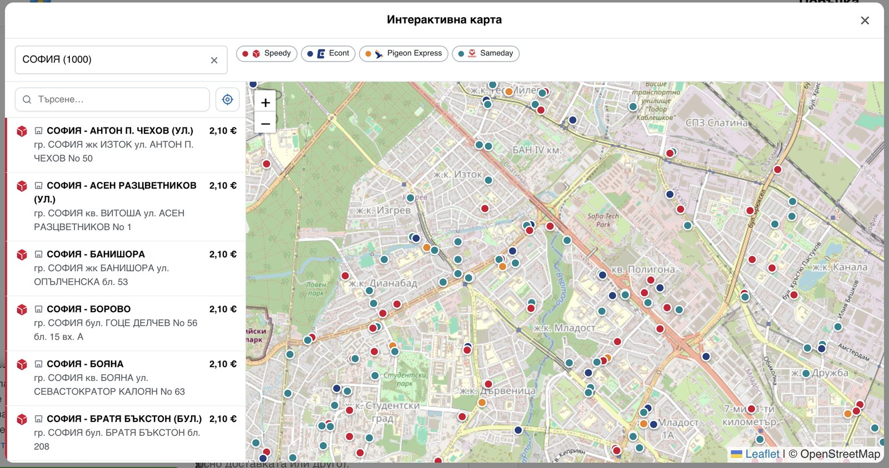

# BG Couriers for WooCommerce

Ship with Bulgaria's couriers straight from WooCommerce: **Speedy, Econt, Pigeon Express, Sameday,
Express One, Европът and BOX NOW**. Your customer picks where the parcel goes and sees what it costs;
you print the label and follow the parcel without leaving WordPress.

**Install it from WordPress.org:** https://wordpress.org/plugins/bg-couriers/
Free, GPL, and staying that way: every courier, every feature, no paid tier. Deliveries are within
Bulgaria.

## What your customer sees

Every courier you switch on shows its own price for the basket, live from that courier's API. The
customer picks how the parcel is delivered (to an office, to an address, or to a locker) and finds the
pickup point by typing the town, or by pointing at it on one map that carries every courier's offices
and lockers at once.

## What you get in the admin

One click issues the waybill and the label: one order, or fifty of them into a single PDF. Each
shipment's status is then kept up to date on its own, and your customer sees the waybill and a
tracking link on their order and in the e-mails you already send them.

## Setting it up

You need your own account with each courier you want to offer. The prices your customers see and the
labels you print are your own contract's, and nothing is resold through this plugin.

1. Paste the API credentials on that courier's tab and switch the courier on. The plugin checks them
   with the courier there and then.
2. Sync its towns and offices: one button.
3. Add it to your **Bulgaria** shipping zone.

Everything else already has a working default. Getting the credentials is the slow part, and
[`docs/getting-api-credentials.md`](docs/getting-api-credentials.md) says who to ask, per courier.

Bugs and ideas: https://github.com/dangoriaynov/bg-couriers/issues
Working on the code: [`CONTRIBUTING.md`](CONTRIBUTING.md) (architecture, tests, releasing).

## Couriers

All seven are live on `main` and published on WordPress.org.

| Courier | Delivers to | Notes |
|---|---|---|
| **Speedy** | office · address · APS | Choose which office you hand parcels in at |
| **Econt** | office · address · Econtomat | Наложен платеж with an itemised опис and the ППП agreement |
| **Pigeon Express** | office · address · locker | |
| **Sameday** | office · address · easyBox | Full lockers are greyed out at the checkout |
| **Express One** | office · address · EXOBOX | The street comes from Express One's own list. No COD to a locker |
| **Европът** | office · address | Its prices include VAT, which the plugin splits back out. No lockers, and no public tracking page |
| **BOX NOW** | lockers (APM) | Flat rate, picked on BOX NOW's own map widget. Prepaid only: it cannot do наложен платеж |

**Български пощи is not planned.** They have no public API, integration is only under contract, and no
Bulgarian integrator carries them. Dropped 2026-08-17; the research is in
[`docs/courier-api-access.md`](docs/courier-api-access.md) so it is not repeated.

## Features

### At the checkout

- **Live prices** from each courier's API, per delivery type. A daily reference price stands in before
  the customer names a town, and a configured fallback covers an API that is down.
- **Delivery types as tabs**, with searchable town and office pickers.
- **One map for every courier**: every enabled courier's offices and lockers for a town at once, each
  point priced for the way it is collected. Bundled Leaflet, no CDN.
- **Closest to you**: how far each point is, which is nearest, and what collecting from it saves
  against delivery to the door. Worked out in the browser; the customer's position is never stored.
- **Cart estimate**, optional, before the customer reaches the checkout.
- **Validation per courier**: an order cannot be placed without a destination that the chosen courier
  can actually accept.
- Works on both the classic and the block checkout.

### Labels and tracking

- Waybill and label in one click, per order or in bulk into one combined PDF (A6 labels or an A4
  sheet).
- Automatic labels when an order reaches a status you choose, per courier or globally, and held until
  the dispatch day when the order names one.
- Shipment status kept up to date on its own; waybill and track link on the order, in the customer's
  e-mails and in the orders list.
- Request a courier to collect the parcels (Speedy, Econt, Express One, Европът).

### Money

- **Наложен платеж**, with the choice of who pays the delivery.
- When the delivery is paid at the door, the order and the customer's e-mail say how much that will
  be, without adding it to the total.
- Free-shipping thresholds per courier and per delivery type; insurance; several parcels per shipment.

### Settings

- One tab per courier, showing only the fields that courier uses.
- Drag to reorder the couriers and the delivery options; pick a default courier.
- Choose where the delivery block sits on the classic checkout: in the order review, or under the
  customer's details.
- Fully translated to Bulgarian.

### Not offered yet

- **Delivery to another country** (Speedy) is built and measured, and switched off in the plugin: the
  feature is unfinished, so no shop is offered a foreign delivery and no setting turns one on. See
  [`docs/international-shipping.md`](docs/international-shipping.md).

## License

GPLv2-or-later, published free on **WordPress.org**.
© Dan Goriaynov.
